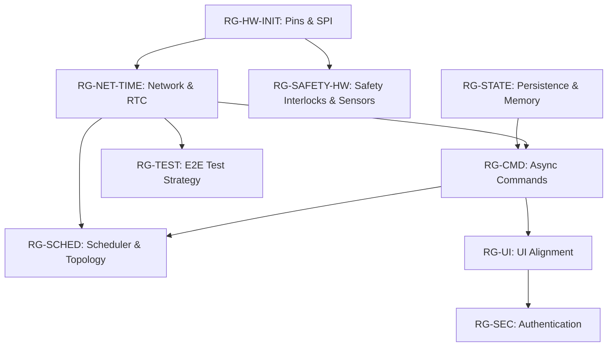

# AI REMEDIATION DEPENDENCY GRAPH V1

### Explanations:
- **RG-HW-INIT** is the foundation. Without safe pins and SPI initialized, network (if SPI-based) and safety (actuator pins) cannot function correctly.
- **RG-NET-TIME** provides the time dependency (RTC) required by the Scheduler (**RG-SCHED**).
- **RG-STATE** provides NVS persistence required by the Command Queue (**RG-CMD**) for idempotency and safe storage.
- **RG-CMD** establishes the true async API boundary, which **RG-UI** depends on (it needs the `postCommand` interface to exist).
- **RG-SCHED** requires **RG-CMD** to actually execute the tasks it schedules.
- **RG-SEC** should be layered on after the UI and Commands are aligned to avoid blocking early testing.
