# PETA VISUAL PERIFERAL & PINOUT ESP32-S3 (MERMAID FLOWCHART)

**Target Board:** ESP32-S3-WROOM-1-N16R8 (16MB Octal Flash, 8MB Octal PSRAM)  
**Tipe Dokumen:** Renderable Visual Hardware & Peripheral Diagram  
**Authority Reference:** [HARDWARE_WIRING_MAP.md](file:///d:/template/docs/HARDWARE_WIRING_MAP.md) & [ESP32_GPIO_PIN_MAP.md](file:///d:/template/docs/ESP32_GPIO_PIN_MAP.md)  
**Status:** **ACTIVE CONTRACT VISUALIZATION (VERIFIED 100%)**

> [!TIP]
> **Cara Melihat Diagram Visual:**
> - Di VS Code / Antigravity IDE: Buka file ini lalu tekan `Ctrl + Shift + V` (atau klik ikon **Open Preview to the Side** di kanan atas).
> - Diagram di bawah akan langsung dirender menjadi flowchart grafis berwarna dengan komponen lengkap dan jalur perkabelannya.

---

## 1. Diagram Alur Koneksi Periferal & ESP32-S3

```mermaid
flowchart TD
    %% Styling
    classDef esp fill:#1e293b,stroke:#38bdf8,stroke-width:2px,color:#f8fafc;
    classDef power fill:#b45309,stroke:#f59e0b,stroke-width:1.5px,color:#fff;
    classDef ac fill:#dc2626,stroke:#ef4444,stroke-width:1.5px,color:#fff;
    classDef dc fill:#0369a1,stroke:#0ea5e9,stroke-width:1.5px,color:#fff;
    classDef sensor fill:#15803d,stroke:#22c55e,stroke-width:1.5px,color:#fff;
    classDef spi fill:#6d28d9,stroke:#a855f7,stroke-width:1.5px,color:#fff;
    classDef safety fill:#991b1b,stroke:#f87171,stroke-width:2px,color:#fff;
    classDef btn fill:#475569,stroke:#94a3b8,stroke-width:1.5px,color:#fff;

    subgraph ESP32_CORE ["ESP32-S3-WROOM-1-N16R8 Central Controller"]
        ESP["ESP32-S3 Core Controller<br/>Dual-Core LX7 240MHz<br/>16MB Flash - 8MB Octal PSRAM"]:::esp
    end

    subgraph PWR ["Sistem Distribusi Daya Power Network"]
        AC_IN["PLN AC 220V Input"]:::power
        PSU["PSU Switching S-250-12<br/>12V DC 20A"]:::power
        BUCK["LM2596 Step-Down Buck<br/>Output 5.05V DC"]:::power
        VCC33["ESP32 Internal LDO 3.3V Rail"]:::power

        AC_IN --> PSU
        PSU -->|12V DC Rail| BUCK
        BUCK -->|5.05V Vin Left-21| ESP
        ESP -->|3.3V Sensor Rail Left-1-2| VCC33
    end

    subgraph ACT_AC ["Beban AC 220V High Voltage"]
        RLY_AC1["Omron Relay Module 1<br/>Koil Driver 3.3V/5V"]:::ac
        RLY_AC2["Omron Relay Module 2<br/>Koil Driver 3.3V/5V"]:::ac
        PUMP_WELL["Pompa Celup Sumur Dalam<br/>Deep Well 220V AC"]:::ac
        PUMP_BOOST["Pompa Booster GH-1<br/>220V AC"]:::ac

        ESP -->|GPIO 1 Right-4 Active-LOW| RLY_AC1
        RLY_AC1 --> PUMP_WELL
        ESP -->|GPIO 2 Right-5 Active-LOW| RLY_AC2
        RLY_AC2 --> PUMP_BOOST
        AC_IN -.->|220V AC Power| RLY_AC1
        AC_IN -.->|220V AC Power| RLY_AC2
    end

    subgraph ACT_DC ["Aktuator DC 12V Relays and MOSFETs"]
        RLY_BOARD["4-Channel Relay Board Optocoupler 5V"]:::dc
        PUMP_RAW["Pompa Air Baku Celup<br/>Submersible 12V DC"]:::dc
        ALARM_BEACON["Lampu Alarm Sistem / Beacon Merah<br/>12V DC"]:::dc

        MOS1["MOSFET Module 1 LR7843<br/>Optocoupler Isolated"]:::dc
        MOS2["MOSFET Module 2 LR7843<br/>Optocoupler Isolated"]:::dc
        MOS3["MOSFET Module 3 LR7843<br/>Optocoupler Isolated"]:::dc
        PUMP_DOS_A["Dosing Pump A Nutrisi<br/>Peristaltik 12V DC"]:::dc
        PUMP_DOS_B["Dosing Pump B Buffer<br/>Peristaltik 12V DC"]:::dc
        FAN_EXH["Kipas Panel Box<br/>Exhaust Fan 12V DC"]:::dc

        ESP -->|GPIO 4 Left-4 IN1 Active-LOW| RLY_BOARD
        RLY_BOARD --> PUMP_RAW
        ESP -->|GPIO 18 Left-11 IN2 Active-LOW| RLY_BOARD
        RLY_BOARD --> ALARM_BEACON
        ESP -->|GPIO 10 Left-16 IN3 Active-LOW| RLY_BOARD
        RLY_BOARD -.->|Trigger Koil A1-A2| CONTACTOR_BLOWER["Kontaktor Magnetik AC<br/>Blower Trigger"]:::ac
        CONTACTOR_BLOWER --> BLOWER_FANS["2x Kipas Blower Greenhouse<br/>220V AC Paralel"]:::ac

        ESP -->|GPIO 5 Left-5 PWM Gate| MOS1
        MOS1 --> PUMP_DOS_A
        ESP -->|GPIO 6 Left-6 PWM Gate| MOS2
        MOS2 --> PUMP_DOS_B
        ESP -->|GPIO 7 Left-7 PWM Gate| MOS3
        MOS3 --> FAN_EXH

        PSU -.->|12V Load Supply| RLY_BOARD
        PSU -.->|12V Load Supply| MOS1
        PSU -.->|12V Load Supply| MOS2
        PSU -.->|12V Load Supply| MOS3
    end

    subgraph BUS_COMM ["Bus Komunikasi dan Sensor I2C and 1-Wire"]
        RTC["RTC DS3231 Module<br/>Backup CR2032"]:::sensor
        TEMP["Sensor Suhu DS18B20<br/>Probe Stainless"]:::sensor

        ESP ---|GPIO 8 SDA - GPIO 9 SCL I2C| RTC
        ESP ---|GPIO 17 DATA 1-Wire| TEMP
        VCC33 -.->|3.3V VCC| RTC
        VCC33 -.->|3.3V VCC| TEMP
    end

    subgraph SPI_PERIPH ["Display and Logging Shared SPI2 Bus"]
        TFT["Display 1.8 inch TFT ST7735<br/>128x160 SPI"]:::spi
        SD["Slot MicroSD Terintegrasi<br/>Belakang PCB TFT"]:::spi

        ESP -->|GPIO 11 Left-17 SCK Clock| TFT
        ESP -->|GPIO 11 Left-17 SCK Clock| SD

        ESP -->|GPIO 12 Left-18 MOSI Data| TFT
        ESP -->|GPIO 12 Left-18 MOSI Data| SD

        SD -->|GPIO 13 Left-19 MISO Data| ESP

        ESP -->|GPIO 14 Left-20 TFT CS| TFT
        ESP -->|GPIO 21 Right-18 A0-DC Cmd| TFT
        ESP -->|GPIO 42 Right-6 RESET| TFT
        ESP -->|GPIO 48 Right-16 SD CS| SD

        VCC33 -.->|3.3V VCC and LED| TFT
        VCC33 -.->|3.3V VCC| SD
    end

    subgraph SENS_FLOW ["Sensor Aliran Air Hall 5V"]
        DIV1["Divider 2.2k-3.3k ke 3.0V"]:::sensor
        DIV2["Divider 2.2k-3.3k ke 3.0V"]:::sensor
        FLOW1["Sensor Flow ZJ-B1 DN15<br/>Air Baku (Raw Water)"]:::sensor
        FLOW2["Sensor Flow FS400A G1<br/>Fertigasi (Fertigation)"]:::sensor

        FLOW1 --> DIV1
        DIV1 -->|GPIO 15 Left-8 Pulse Counter| ESP
        FLOW2 --> DIV2
        DIV2 -->|GPIO 16 Left-9 Pulse Counter| ESP

        BUCK -.->|5V Hall Power| FLOW1
        BUCK -.->|5V Hall Power| FLOW2
    end

    subgraph INTERLOCKS ["Sistem Keamanan dan Interlock"]
        FLOAT["Pelampung Stainless Lower Float<br/>Dasar Tangki"]:::safety
        TAMPER["Loop Proteksi Anti-Theft<br/>Kawat Loop Fisik ke Ground"]:::safety

        FLOAT -->|GPIO 38 Right-10 Active-LOW Dry-Run| ESP
        TAMPER -->|GPIO 47 Right-17 Active-HIGH Tamper Stop| ESP
    end

    subgraph BUTTONS ["Tombol Panel Fisik"]
        BTN_MODE["Button 1: Switch Layar TFT<br/>Paralel BOOT Button"]:::btn
        BTN_WELL["Button 2: Manual Well Pump<br/>Toggle 5-Min Auto-Off"]:::btn
        BTN_RES3["Button 3: RESERVED / TBD<br/>Software Debounce 40ms"]:::btn
        BTN_RES4["Button 4: RESERVED / TBD<br/>Software Debounce 40ms"]:::btn

        BTN_MODE -->|GPIO 0 Right-14 Active-LOW Switch Screen| ESP
        BTN_WELL -->|GPIO 39 Right-9 Active-LOW 5-Min Timer| ESP
        BTN_RES3 -->|GPIO 40 Right-8 Active-LOW Reserved| ESP
        BTN_RES4 -->|GPIO 41 Right-7 Active-LOW Reserved| ESP
    end
```

---

## 2. Ringkasan Singkat Pinout Periferal Berdasarkan Diagram

| Kategori Periferal | Nama Komponen | Pin ESP32-S3 | Lokasi Header | Tipe Sinyal / Protokol | Catatan Kelistrikan & Logika |
|:---|:---|:---:|:---:|:---|:---|
| **Daya (Power)** | LM2596 Step-Down | **5V (Vin)** | Left-21 | Input Daya Utama | Dikunci 5.05V DC dari PSU 12V |
| **Daya (Power)** | Rel 3.3V Sensor | **3V3 Rail** | Left-1 / Left-2 | Output Daya Sensor | Maksimum 500mA untuk modul 3.3V |
| **Beban AC 220V** | Omron Relay 1 | **GPIO 1** | Right-4 | Digital Output | Active-LOW (Pompa Sumur Dalam) |
| **Beban AC 220V** | Omron Relay 2 | **GPIO 2** | Right-5 | Digital Output | Active-LOW (Pompa Booster Distribusi) |
| **Beban DC 12V** | 4-Ch Relay IN1 | **GPIO 4** | Left-4 | Digital Output | Active-LOW (Pompa Air Baku Celup) |
| **Beban DC 12V** | 4-Ch Relay IN2 | **GPIO 18** | Left-11 | Digital Output | Active-LOW (Lampu Alarm Sistem) |
| **Beban AC 220V** | 4-Ch Relay IN3 | **GPIO 10** | Left-16 | Digital Output | Active-LOW (Trigger Kontaktor Magnetik 2x Kipas Blower Greenhouse - Booked/Standby) |
| **Beban DC 12V** | MOSFET Modul 1 | **GPIO 5** | Left-5 | PWM / Digital Out | Active-LOW Gate (Dosing Pump A Nutrisi) |
| **Beban DC 12V** | MOSFET Modul 2 | **GPIO 6** | Left-6 | PWM / Digital Out | Active-LOW Gate (Dosing Pump B pH) |
| **Beban DC 12V** | MOSFET Modul 3 | **GPIO 7** | Left-7 | PWM / Digital Out | Active-LOW Gate (Kipas Exhaust Box) |
| **Bus Komunikasi** | DS3231 RTC (SDA) | **GPIO 8** | Left-12 | I2C Data (SDA) | Bi-directional, wajib pull-up 4.7kΩ |
| **Bus Komunikasi** | DS3231 RTC (SCL) | **GPIO 9** | Left-15 | I2C Clock (SCL) | Clock Out, wajib pull-up 4.7kΩ |
| **Bus Komunikasi** | DS18B20 Temp | **GPIO 17** | Left-10 | 1-Wire Bus | Bi-directional, wajib pull-up 4.7kΩ ke 3.3V |
| **Display & SD** | TFT & SD SCK | **GPIO 11** | Left-17 | SPI Master Clock | Bus SPI bersama (SPI2_HOST) |
| **Display & SD** | TFT & SD MOSI | **GPIO 12** | Left-18 | SPI Master Out | Bus SPI bersama (SPI2_HOST) |
| **Display & SD** | MicroSD MISO | **GPIO 13** | Left-19 | SPI Master In | Dedicated MISO dari slot MicroSD |
| **Display & SD** | TFT Chip Select | **GPIO 14** | Left-20 | SPI Chip Select | Dedicated CS layar ST7735 |
| **Display & SD** | TFT Data/Cmd (DC)| **GPIO 21** | Right-18 | Control Line | High=Data, Low=Command |
| **Display & SD** | TFT Hardware RST | **GPIO 42** | Right-6 | Control Line | Dedicated Reset layar ST7735 |
| **Display & SD** | SD Chip Select | **GPIO 48** | Right-16 | SPI Chip Select | Dedicated CS slot MicroSD |
| **Sensor Aliran** | Flow ZJ-B1 (Air Baku) | **GPIO 15** | Left-8 | Pulse Interrupt | Melewati divider 2.2k/3.3k (Raw Water → Mixing Tank, Calibration Req) |
| **Sensor Aliran** | Flow FS400A (Fertigasi)| **GPIO 16** | Left-9 | Pulse Interrupt | Melewati divider 2.2k/3.3k (Delivery loop, F=4.8*Q -> 288 pulses/L) |
| **Safety Interlock**| Lower Float Switch| **GPIO 38** | Right-10 | Digital Input | Active-LOW (0 = Tanki Kering, Stop Pompa)|
| **Security Loop** | Anti-Theft Loop | **GPIO 47** | Right-17 | Digital Input | Active-HIGH (1 = Putus / Dicuri, E-Stop) |
| **Tombol Panel** | Button 1 (TFT Switch) | **GPIO 0** | Right-14 | Digital Input | Active-LOW (Switch layar TFT, BOOT caveat) |
| **Tombol Panel** | Button 2 (Well Pump)  | **GPIO 39** | Right-9 | Digital Input | Active-LOW (Toggle Pompa Sumur 5-menit timer & dry-run interlock) |
| **Actuator** | Mixing Pump Relay IN4 | **GPIO 40** | Right-8 | Digital Output | Active-LOW (0=ON); Button 3 physical input RETIRED/disconnected |
| **Tombol Panel** | Button 4 (Reserved)   | **GPIO 41** | Right-7 | Digital Input | Active-LOW output (0=ON); Button 3 physical input is RETIRED/disconnected |
